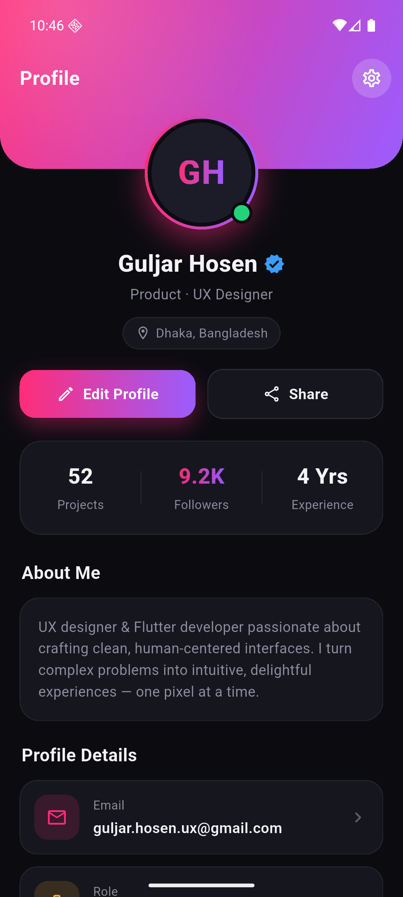

# Profile App

A profile screen built with **Flutter**, featuring a custom dark theme with a
pink-to-purple gradient header, a gradient-ring avatar, an accented stats card,
and color-coded detail tiles.

<p align="center">
  
</p>

## ✨ Features

- Custom dark UI with a gradient header banner (built from scratch, no templates)
- Gradient-ring avatar with an online status badge
- Stats card — Projects · Followers · Experience — with a gradient-accented value
- "About Me" section and color-coded profile detail tiles
- Smooth fade-in entrance animation

## 🛠️ Built With

- [Flutter](https://flutter.dev) · Dart · Material 3
- **100% Dart** — all widgets are hand-built, no third-party UI packages

## 🚀 Getting Started

```bash
flutter pub get
flutter run
```

Runs on Android, iOS, web, and desktop from the same codebase.

## 📁 Project Structure

- `lib/main.dart` — the full app (UI and all custom widgets)

---

Made with Flutter 💙
